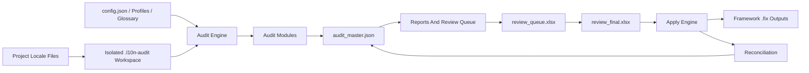

# System Architecture

## High-Level Architecture

L10n Audit Toolkit is a CLI-first Python application with an optional HTTP reference API. Its architecture is built around isolated audit execution, normalized findings, a central master artifact, human review, frozen apply contracts, and safe reconciliation.

## Components

- **CLI layer:** `l10n_audit/core/cli.py` defines user commands and argument validation.
- **Public API layer:** `l10n_audit/api.py` exposes `run_audit`, `init_workspace`, and `doctor_workspace`.
- **Runtime and workspace layer:** loads configuration, detects projects, prepares isolated workspace files, and resolves artifact paths.
- **Engine layer:** orchestrates audit stages and delegates to module implementations.
- **Audit module layer:** pure or mostly pure detectors that emit structured findings.
- **Aggregation layer:** normalizes module output into master state, dashboards, and review workbooks.
- **Review/apply layer:** freezes approved rows and applies only validated frozen contracts.
- **Adaptive workflow layer:** creates adaptation reports, consumption manifests, reviewed manifests, and approved config changes.
- **Optional HTTP layer:** FastAPI reference server wrapping public API functions.

## Services

- **CLI service:** primary operational interface for local development and CI/CD.
- **Python API service:** in-process API for downstream Python integrations.
- **HTTP API service:** optional local/reference service with health, audit, doctor, and init endpoints.
- **AI provider service:** optional external OpenAI-compatible provider accessed through LiteLLM.
- **LanguageTool service:** optional local grammar checking dependency requiring Java.

## Modules

- `l10n_audit/audits/l10n_audit_pro.py`: extended missing/usage audit logic.
- `l10n_audit/audits/basic_consistency_audit.py`: basic consistency checks.
- `l10n_audit/audits/en_locale_qc.py`: English source locale quality checks.
- `l10n_audit/audits/ar_locale_qc.py`: Arabic formatting and quality checks.
- `l10n_audit/audits/ar_semantic_qc.py`: Arabic semantic review candidates.
- `l10n_audit/audits/placeholder_audit.py`: placeholder consistency.
- `l10n_audit/audits/terminology_audit.py`: glossary and terminology enforcement.
- `l10n_audit/audits/icu_message_audit.py`: ICU-like message validation.
- `l10n_audit/audits/en_grammar_audit.py`: LanguageTool-backed grammar checks.
- `l10n_audit/audits/ai_review.py`: optional AI-assisted review.
- `l10n_audit/audits/camel_validation.py`: CAMeL-related Arabic validation.
- `l10n_audit/reports/report_aggregator.py`: report and review projection.
- `l10n_audit/fixes/apply_review_fixes.py`: reviewed fix application.
- `l10n_audit/fixes/apply_safe_fixes.py`: deterministic safe-fix application.
- `l10n_audit/fixes/fix_merger.py`: apply validation and merge support.

## Databases

The project does not use a relational or document database server. It uses file-based artifacts:

- `audit_master.json`: central pipeline state and traceability record.
- `review_queue.xlsx`: editable human review workspace.
- `review_final.xlsx`: frozen execution contract.
- `final_audit_report.json` and `.md`: machine-readable and human-readable reports.
- Manifest JSON files: controlled configuration adaptation workflow artifacts.
- `.fix` files: generated locale fix outputs.

See `docs/DATABASE.md` for detailed artifact fields, relationships, and CRUD behavior.

## External Integrations

- OpenAI-compatible AI providers through LiteLLM.
- LanguageTool through Java and `language-tool-python`.
- Optional CAMeL tooling/fallback behavior documented in architecture notes.
- CI/CD systems through CLI execution.
- FastAPI/Uvicorn when HTTP API is used.

## Data Flow

1. Project locale files and configuration are loaded.
2. Workspace isolation copies or stages source inputs.
3. Selected audit modules produce structured findings.
4. Aggregation writes master state and user-facing reports.
5. Review queue captures human decisions.
6. Prepare-apply validates and freezes approved rows.
7. Apply validates frozen rows and writes framework-specific fix outputs.
8. Reconciliation updates audit state.

## Deployment Architecture

- **Local CLI:** installed with `pip install -e .` or package installation and run via `l10n-audit`.
- **CI/CD:** same CLI commands executed in pipelines with artifacts collected from `Results/`.
- **HTTP reference API:** optional FastAPI service run with Uvicorn for local or internal automation.
- **Documentation site:** existing public documentation can consume the Markdown docs in `docs/`.

## Security Architecture

- Workspace isolation prevents audit-time source mutation.
- Apply requires frozen workbook input.
- Source hash validation blocks stale changes.
- Contract validation blocks tampered or incomplete approved rows.
- AI secrets are supplied through environment or runtime options, not persisted as documentation.
- Adaptive configuration changes require reviewed manifests.
- HTTP API has no built-in authentication and should not be exposed to untrusted networks without an additional security layer.

## Architectural Constraints

- File artifact contracts are core product interfaces.
- `review_queue.xlsx` and `review_final.xlsx` have distinct responsibilities and must not collapse into one artifact.
- Audit modules should remain independent from apply modules.
- Deterministic stages must remain usable without optional AI integrations.
- Future database-backed or UI-backed products must preserve current safety invariants.

