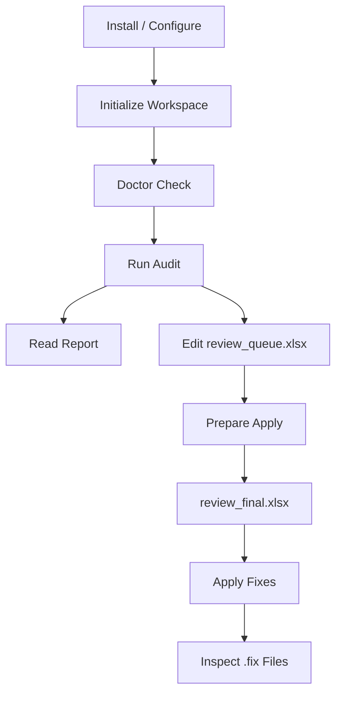

# UI/UX Documentation

## Screens

The toolkit does not provide a native graphical interface. User interaction happens through operational surfaces:

- CLI terminal output.
- Markdown final audit report.
- Excel review workbooks.
- JSON artifacts for automation.
- Optional FastAPI Swagger UI.

## User Journeys

### Developer Audit Journey

1. Install package and dependencies.
2. Run `l10n-audit init`.
3. Run `l10n-audit run --stage fast` or `full`.
4. Inspect CLI output and final report.
5. Share review workbook with localization reviewer.

### Localization Review Journey

1. Open `Results/review/review_queue.xlsx`.
2. Inspect source, target, issue, and suggestion fields.
3. Approve, reject, or edit approved values.
4. Save workbook for freezing.

### Safe Apply Journey

1. Run `l10n-audit prepare-apply`.
2. Review rejection report if generated.
3. Run `l10n-audit apply`.
4. Inspect generated `.fix` files before merging.

### CI/CD Journey

1. Pipeline installs dependencies.
2. Pipeline runs deterministic audit stage.
3. Pipeline captures `Results/` artifacts.
4. Pipeline fails or warns based on configured policy.

### API Journey

1. Developer starts FastAPI server.
2. API client calls `/health`.
3. API client calls workspace or audit endpoint.
4. Client consumes JSON response.

## Navigation Flow

## Wireframes Description

### CLI Output

- Command invocation line.
- Progress and selected stage information.
- Warnings and errors.
- AI status when enabled.
- Output artifact paths.
- Final success/failure summary.

### Markdown Report

- Audit summary.
- Issue counts.
- Findings grouped by type or severity.
- Links or references to review artifacts.
- Decision quality metrics when available.

### Review Workbook

- One row per reviewable finding.
- Columns for key, locale, issue, source, target, suggestion, decision, approved value, identity metadata, and notes.
- Human-editable decision fields.
- Stable schema required for freezing.

### Frozen Workbook

- Generated-only execution contract.
- Contains approved validated rows.
- Not designed for manual editing.

### Swagger UI

- FastAPI-generated documentation for HTTP endpoints.
- Request and response model inspection.
- Manual endpoint execution for local testing.

## Design Decisions

- CLI-first UX supports developers and CI/CD with minimal infrastructure.
- Excel review UX matches common localization reviewer workflows.
- Markdown reports remain readable in repositories, CI artifacts, and documentation sites.
- Separate review and final workbooks reduce accidental unsafe application.
- Optional API UX exists for integrations without changing core CLI behavior.

## Accessibility Notes

- CLI messages should avoid unnecessary noise and clearly show actionable failures.
- Markdown reports should use clear headings and tables.
- Review workbook column names should remain descriptive and stable.
- Arabic documentation should remain available for core usage flows.
- Error messages should explain next steps when possible.

## UX Considerations

- Users must understand that `review_queue.xlsx` is editable but not executable.
- Users must run `prepare-apply` before `apply`.
- AI suggestions should be labeled as suggestions, not authoritative corrections.
- Rejection reports should explain why rows were excluded.
- Generated artifact paths should be printed clearly for terminal and CI users.
- Optional HTTP API should be described as a reference integration surface, not the primary workflow.

