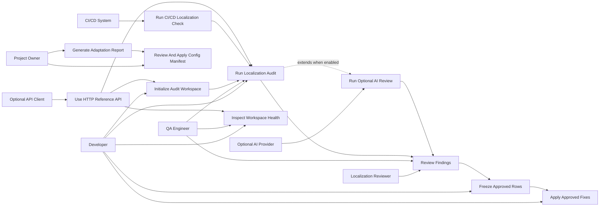

# Use Case Diagram

## Actors

- **Developer:** configures projects, runs audits, freezes approved changes, and applies fixes.
- **Localization Reviewer:** reviews findings and approves or rejects suggested changes.
- **QA Engineer:** validates localization readiness and consumes reports.
- **CI/CD System:** runs automated audit checks and stores artifacts.
- **Project Owner:** controls business rules, glossary expectations, and configuration adaptation approvals.
- **Optional API Client:** calls the FastAPI reference endpoints.
- **Optional AI Provider:** supplies AI-assisted suggestions when enabled.

## Use Cases

- Initialize audit workspace.
- Inspect workspace health.
- Run localization audit.
- Run optional AI review.
- Review findings.
- Freeze approved rows.
- Apply approved fixes.
- Generate adaptation report.
- Generate, review, and apply configuration manifest.
- Run CI/CD localization check.
- Use HTTP reference API.

## Relationships

- Initialization precedes normal audit execution.
- Audit execution produces review artifacts.
- Review findings precedes freezing approved rows.
- Freezing approved rows precedes applying approved fixes.
- Optional AI review extends audit execution but does not replace human review.
- CI/CD execution uses the same audit workflow with automated triggers.
- HTTP API wraps workspace and audit use cases through JSON endpoints.
- Configuration manifest apply depends on explicit project-owner approval.

## Mermaid UML

