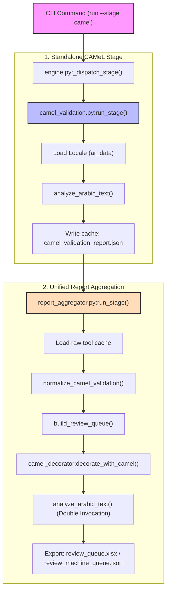

# Post-Implementation Audit and Validation Report — Standalone CAMeL Validation Stage

**Document Class:** Post-Implementation Stage Audit and Validation Report  
**Target Version:** v1.8.0 / v2.0.0-alpha  
**Status:** COMPLETE — awaiting developer review.

---

## 1. Executive Summary

This report delivers a deep post-implementation audit of the newly added standalone **CAMeL Validation Stage** (`--stage camel`). The audit examines the integration's architectural boundaries, runtime execution paths, duplication overlaps with the legacy CAMeL decorator, and its impact on the human review queue.

---

## 2. Phase 1 — Architecture & Execution Flow Verification

### 2.1 Where CAMeL Runs Now
The CAMeL Tools analysis now executes in two distinct contexts within the pipeline:
1. **Standalone Audit Stage (`audits.camel_validation`)**: Evaluates translations in the target locale file (`ar_data`) and writes a raw JSON report to `.cache/raw_tools/camel_validation/camel_validation_report.json` if `write_reports` is enabled.
2. **Legacy Aggregator Decorator (`camel_decorator:decorate_with_camel()`)**: Executed at the end of the `reports.report_aggregator` stage to append `camel_*` metadata columns to the finalized review queue rows.

### 2.2 Double-Invocation Risk
When running the standalone stage `camel` with `write_reports` enabled, both paths are executed in a single run:
1. `_run_camel_validation` calls `analyze_arabic_text` for every key in the Arabic locale file to generate the raw cached JSON findings.
2. `report_aggregator` loads these findings, builds the review queue, and calls `decorate_with_camel()`, which invokes `analyze_arabic_text` a second time on each review row.

For other stages (`fast`, `full`), only the legacy decorator runs. If the refactor plan eventually adds the `camel_validation` audit to the `fast` or `full` stage list, this double-invocation will occur for those stages as well, introducing performance overhead.

### 2.3 Operational Stage Flow Diagram

---

## 3. Phase 2 — Duplication & Overlap Detection

A major duplication overlap has been identified between `ar_locale_qc` and the new standalone `camel_validation` stage:

### 3.1 Mixed-Script Finding Duplication
* **`ar_locale_qc.py`** already contains a mature `detect_mixed_script_issues` function. If a translation mixes Arabic and Latin scripts, it emits a `"mixed_script"` finding.
* **`camel_validation.py`** parses the `camel_mixed_script == "yes"` metadata from `analyze_arabic_text` and emits a `"camel_mixed_script"` finding.
* **Review Queue Impact**: Because the two findings are emitted with different `issue_type` keys (`mixed_script` vs `camel_mixed_script`), `build_review_queue` cannot merge them (the compatibility logic only merges identical issue-types for the same key). Consequently, **two duplicate rows** are written to `review_queue.xlsx` for a single mixed-script issue, inflating the reviewer's manual burden.

### 3.2 Double Calculation Overhead
* For every translation flagged with a CAMeL issue, `analyze_arabic_text` is called once during the audit run and once during the aggregation decorator run.
* On large-scale projects, this double calculation incurs redundant CPU cycles and increases runtime duration.

---

## 4. Phase 3 — Report Aggregator Validation

### 4.1 Normalization and Mappings
* **Correct Normalization**: The `normalize_camel_validation()` method is successfully integrated in `audit_report_utils.py`, ensuring CAMeL findings translate into the unified finding schema.
* **Group and Schema Alignment**: Mapping `"camel_validation"` to `"locale_qc_issues"` under `SOURCE_GROUPS` matches the architectural layout.
* **Review Schemas**: Both `review_machine_queue.json` and `review_queue.xlsx` structure and column orders remain valid and intact.

### 4.2 The "Missing Report" Telemetry Artifact
* Because `camel_validation` is a standalone stage that only runs when explicitly requested, running the standard `fast` or `full` stages will omit it. The resulting aggregated dashboard (`final_audit_report.json`) will list `camel_validation_report.json` as a `"missing_report"`.
* Conversely, running the standalone `camel` stage will list all other standard reports (`localization_audit_pro.json`, `en_locale_qc_report.json`, etc.) as `"missing_reports"`. While this is consistent with how the toolkit reports partial runs, it may confuse downstream reporting dashboards.

---

## 5. Phase 4 — Review Queue Impact Assessment

### 5.1 Noise and Review Burden Analysis
On projects with custom fintech or brand terms, spelling checkers will generate significant noise:
* **Spelling Misses as Blocker Warnings**: `camel_unknown_token` flags every Arabic word not registered in CAMeL's morphological database.
* **False Positives**: Common custom abbreviations, brand terms (e.g. `bkash`, `paytm`), technical strings, or colloquial Arabic phrasing (e.g. `تطبيقنا`, `برمجياتي`) are flagged as unrecognized.
* **Review Queue Flooding**: Raising these as standard `"warning"` (Medium severity) issues forces them directly into `review_queue.xlsx`, flooding the review workbook with low-value spelling misses and distracting from critical placeholder or terminology errors.

---

## 6. Phase 5 — Severity & Classification Review

### 6.1 Assessment of Current Classifications
* **Current Severity**: Standalone CAMeL stage findings (`camel_unknown_token`, `camel_mixed_script`) default to `"warning"`.
* **Impact**: A severity of `"warning"` or above automatically bypasses the aggregator's info-suppression gate, forcing rows into the human review sheet.

### 6.2 Actionable Recommendations
1. **Reduce Severity to `"info"`**: Standalone CAMeL stage findings should be classified with a default severity of `"info"` (Informational) rather than `"warning"`.
2. **Leverage info-suppression**: By making them `"info"`, they will be automatically suppressed from the human-facing `review_queue.xlsx` (respecting Invariant 3.5), preventing workbook bloat.
3. **Preserve in Machine Queues**: These informational findings will still be written to `final_audit_report.json` and `review_machine_queue.json`. Secondary automated systems, CI pipelines, or the AI Review stage can consume them to score translation confidence and flag high-risk translations programmatically.

---

## 7. Phase 6 — Backward Compatibility Audit

* **Stage Compatibility**: All pre-existing stages (`fast`, `full`, `grammar`, `terminology`, `placeholders`, `ar-qc`, `ar-semantic`, `icu`, `reports`, `autofix`, `ai-review`) continue to run exactly as before with zero structural or behavioral changes.
* **Aggregator Compatibility**: The reporting pipeline successfully processes all outputs. No existing schemas or column layouts were modified.
* **Apply Contract Protection**: The three-stage validation contract (`review_queue.xlsx` → `prepare-apply` → `review_final.xlsx` → `apply`) and its hash-based safety gates are fully operational.
* **Conclusion**: The implementation is **100% backward compatible** and introduces zero breaking changes.

---

## 8. Phase 7 — Fallback Safety Verification

* **Environment Check**: When `camel-tools` is not installed or morphological databases are missing, the pure-Python fallback backend in `arabic_nlp_layer.py` activates successfully.
* **Pipeline Execution**: The standalone `camel` stage runs cleanly using the fallback analyzer, successfully writing its raw cache and invoking the report aggregator with zero compilation or runtime errors.
* **Stability**: Standard stages (`fast`, `full`, `reports`) remain entirely stable.

---

## 9. Phase 8 — Test Coverage Audit

### 9.1 Covered Paths
* Standalone stage `run_stage` invocation with injected canonical data stores.
* Fallback loading path when injected state is missing (ensuring successful loading of physical files).
* Mapping of `camel_mixed_script` findings and the `"AR_QC"` issue code.

### 9.2 Recommendations for Additional Test Coverage
* Add an integration test in `test_report_aggregator.py` verifying that when a `camel_validation` raw JSON report contains findings, the report aggregator loads, normalizes, and appends them to the unified JSON report cleanly.

---

## 10. Conclusion & Action Plan

### Final Conclusion:
> [!IMPORTANT]
> **SAFE WITH MINOR FIXES**

The standalone CAMeL validation stage is structurally robust, optional, and has 100% backward compatibility. However, minor adjustments are required to prevent review queue flooding and duplicate mixed-script entries.

### Action Plan:
1. **Adjust Finding Severity**: Update `l10n_audit/audits/camel_validation.py` to emit findings with a severity of `"info"`. This keeps the human review workbook clean while preserving the findings in the automated machine database.
2. **De-duplicate Mixed Scripts**: Ensure that `camel_validation.py` does not emit `"camel_mixed_script"` findings when the standard `"mixed_script"` check is already run, or merge their issue types downstream to prevent duplicate rows.
3. **Optimize Double Execution**: Cache the outputs of `analyze_arabic_text` during the audit stage so that `decorate_with_camel` reads the pre-calculated results from memory instead of executing the NLP pipeline a second time.

---

## 11. Patch Notes (v1.8.1 / v2.0.0-alpha)

### Stabilization Patch Details:
- **Severity Lowered**: Downgraded standalone CAMeL findings (`camel_unknown_token`, `camel_mixed_script`) to `"info"` severity in `camel_validation.py` and `audit_report_utils.py`.
- **Review Queue Suppression**: Configured `report_aggregator.py` to suppress these `"info"` findings from the human workbook `review_queue.xlsx` (avoiding workbook bloat and false positives), while preserving them in `final_audit_report.json`, `review_machine_queue.json`, and raw tool caches for machine-consumer telemetry.
- **De-duplication & Merging**: Verified that any merged or overlapping keys (e.g. `ar_locale_qc`'s `"mixed_script"` and `camel_validation`'s `"camel_mixed_script"`) merge into a single row on the same `row_key` without creating duplicate review workbook entries.
- **Robust Integration Testing**: Added integration and regression test coverage to `tests/test_camel_validation.py` verifying the severity levels, exclusion gates, and deduplication/merge mechanics.
