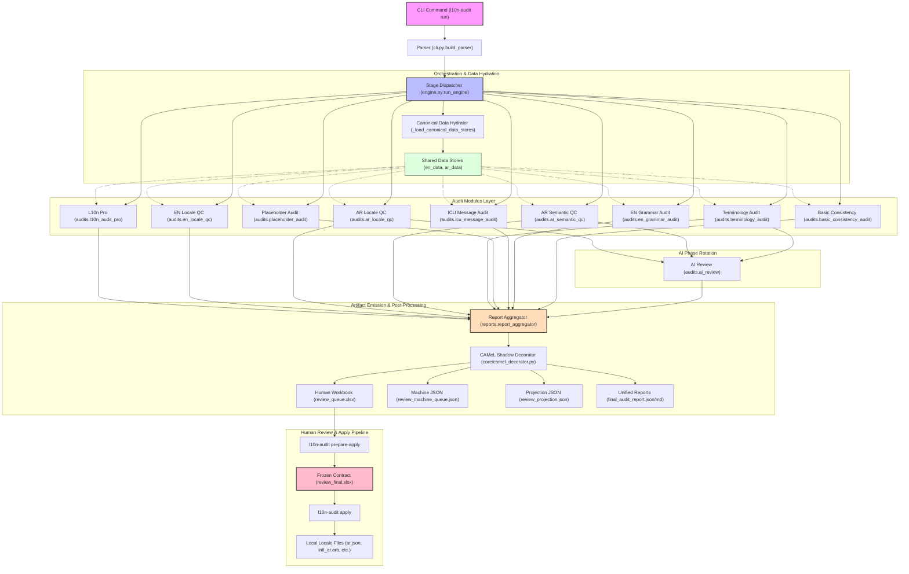

# L10n Audit Toolkit — Current Execution Pipeline

This document describes the actual execution pipeline of the L10n Audit Toolkit as of version 1.5.4. It serves as the architectural baseline for the upcoming pipeline refactor.

---

## 1. Operational Flow and Dependency Map

The following Mermaid diagram maps the flow of execution from the command-line interface (CLI) down through the Stage Dispatcher, individual Audit Modules, the Report Aggregator, and finally into the Human Review and Apply workspaces.



---

## 2. Actual Stage Execution Order

When a user triggers `l10n-audit run --stage <stage_name>`, the pipeline executes a sequence of operations coordinated by `l10n_audit/core/engine.py:_dispatch_stage()`.

### 2.1 The "fast" Stage
1. **Source Discovery & Scan**: Performs standard console log simulation of source code scans.
2. **Sequential Audit Execution**:
   - `L10n Pro` (`audits.l10n_audit_pro`)
   - `EN Locale QC` (`audits.en_locale_qc`)
   - `AR Locale QC` (`audits.ar_locale_qc`)
   - `AR Semantic QC` (`audits.ar_semantic_qc`)
   - `Placeholders` (`audits.placeholder_audit`)
   - `Terminology` (`audits.terminology_audit`)
   - `Basic Consistency` (`audits.basic_consistency_audit`)
3. **AI Review Rotation**: If AI review is enabled, `audits.ai_review` runs *after* these linguistic audits, ingesting all collected issues as context to propose translations or wording corrections.
4. **Report Aggregation**: Runs `reports.report_aggregator` over all fast sources (plus `ai_review` if active), writing Excel and JSON outputs to the results directory.

### 2.2 The "full" Stage
1. **Source Discovery & Scan**: Performs slightly longer source code scanning simulation.
2. **Java / LanguageTool Pre-Flight Check**: Checks if Java is available in the shell path (aborts if LanguageTool requirements are not met).
3. **Sequential Audit Execution**: Executes all audits in the **fast** stage, followed immediately by:
   - `ICU Messages` (`audits.icu_message_audit`)
   - `EN Grammar` (`audits.en_grammar_audit`) (spelling/grammar checking via LanguageTool)
4. **AI Review Rotation**: If enabled, `audits.ai_review` runs, using the wider array of findings.
5. **Report Aggregation**: Runs `reports.report_aggregator` over all full sources (plus `ai_review` if active).

---

## 3. Shared Data Structures and Hydration

To prevent duplicate file-reading and inconsistent key lookups, the pipeline pre-hydrates critical structures before invoking individual audits.

### 3.1 `_load_canonical_data_stores(runtime)`
The engine calls this orchestrator-level method to read and deserialize localization files into memory once:
* **`en` data**: The source English mapping parsed by framework loaders (e.g. JSON, PHP, ARB).
* **`ar` data**: The target Arabic mapping.
* **Returns**: A pre-hydrated dictionary: `{"en": en_data, "ar": ar_data}`.

This centralized dictionary is passed directly as keyword arguments (`en_data`, `ar_data`) to all participating audit modules.

### 3.2 `AuditPaths` (Runtime Context)
Created at startup, this carries absolute path properties:
* `runtime.en_file` & `runtime.ar_file` (parsed/loaded paths).
* `runtime.original_en_file` & `runtime.original_ar_file` (physical paths).
* `runtime.results_dir` (directory for all pipeline outputs, defaults to `.l10n-audit/Results`).
* `runtime.glossary_file` (configured terminology glossary).

### 3.3 `AuditOptions`
A typed configuration object encapsulating CLI and `config.json` parameters. Passed to every audit to govern rules, whitelists, severity, and AI provider overrides.

---

## 4. Intermediate Artifacts and Registry

All intermediate files are resolved dynamically using `l10n_audit/core/artifact_resolver.py`. Conventional output locations are mapped inside a unified `.cache` and output layout under `runtime.results_dir`:

| Key | Conventional Path | Written By | Consumed By |
|---|---|---|---|
| `raw_reports_root` | `.cache/raw_tools/` | Individual Audits | `reports.report_aggregator` |
| `fix_plan_path` | `.cache/apply/fix_plan.json` | `l10n_audit.api:run_audit` | `fixes.apply_safe_fixes` |
| `review_queue_xlsx_path` | `review/review_queue.xlsx` | `reports.report_aggregator` | Human Reviewer |
| `review_projection_json_path` | `review/review_projection.json` | `reports.report_aggregator` | Reporting Dashboard |
| `review_machine_queue_json_path`| `review/review_machine_queue.json`| `reports.report_aggregator` | AI Review Stage |
| `review_final_xlsx_path` | `review/review_final.xlsx` | `prepare-apply` command | `apply` command |
| `master_path` | `artifacts/audit_master.json` | `reports.report_aggregator` | Workflow Reconstructor |
| `adaptation_report_path` | `.cache/adaptation/adaptation_report.json` | Adaptive Intelligence | Controlled Consumption |

---

## 5. Comprehensive Audit Module Directory

The following map defines the input, output, and downstream consumers of every audit module in the toolkit:

### 5.1 `audits.l10n_audit_pro`
* **Inputs**:
  - `runtime` (AST scanner, source files directory).
  - `options` (custom role identifiers, whitelists).
* **Outputs**: `list[AuditIssue]` (type: `missing_key_in_code` or `unused_key_in_file`).
* **Downstream Consumers**: `reports.report_aggregator` (collates discrepancies against localization files).

### 5.2 `audits.en_locale_qc`
* **Inputs**:
  - `en_data` (pre-hydrated English locale dictionary).
  - `options` (capitalization and style flags).
* **Outputs**: `list[AuditIssue]` (type: `casing_error`, `consecutive_spaces`, `trailing_whitespace`).
* **Downstream Consumers**: `reports.report_aggregator`, `fixes.apply_safe_fixes` (for auto-fixing).

### 5.3 `audits.ar_locale_qc`
* **Inputs**:
  - `en_data` & `ar_data` (English and Arabic mappings).
  - `options` (punctuation & letter-normalization rules).
* **Outputs**: `list[AuditIssue]` (type: `punctuation_mismatch`, `yale_normalization`, `indic_digit_mix`).
* **Downstream Consumers**: `reports.report_aggregator`.

### 5.4 `audits.ar_semantic_qc`
* **Inputs**:
  - `en_data` & `ar_data`.
  - `options` (tone guidelines, semantic matching scores).
* **Outputs**: `list[AuditIssue]` (type: `semantic_drift`, `style_guideline_violation`).
* **Downstream Consumers**: `reports.report_aggregator`.

### 5.5 `audits.placeholder_audit`
* **Inputs**:
  - `runtime` (direct file reads of translation pairs).
  - `options` (placeholder regex patterns).
* **Outputs**: `list[AuditIssue]` (type: `placeholder_mismatch`, `token_count_mismatch`).
* **Downstream Consumers**: `reports.report_aggregator` (flagged as a blocker for auto-fixing).

### 5.6 `audits.terminology_audit`
* **Inputs**:
  - `en_data` & `ar_data` (locale mappings).
  - `options.glossary_file` (loaded glossary JSON).
* **Outputs**: `list[AuditIssue]` (type: `terminology_mismatch`, `brand_identity_violation`).
* **Downstream Consumers**: `reports.report_aggregator`, `fixes.apply_safe_fixes` (for auto-fixing glossary violations).

### 5.7 `audits.icu_message_audit`
* **Inputs**:
  - `en_data` & `ar_data` (locale mappings).
  - `options` (ICU syntax rules).
* **Outputs**: `list[AuditIssue]` (type: `icu_syntax_error`, `plural_form_mismatch`).
* **Downstream Consumers**: `reports.report_aggregator`.

### 5.8 `audits.en_grammar_audit`
* **Inputs**:
  - `en_data` (source strings).
  - `options` (LanguageTool rules).
* **Outputs**: `list[AuditIssue]` (spelling, style, grammar issues via local LanguageTool).
* **Downstream Consumers**: `reports.report_aggregator`.

### 5.9 `audits.basic_consistency_audit`
* **Inputs**:
  - `en_data` & `ar_data`.
  - `options` (structural invariants).
* **Outputs**: `list[AuditIssue]` (type: `key_alignment_mismatch`, `empty_translation_string`).
* **Downstream Consumers**: `reports.report_aggregator`.

### 5.10 `audits.ai_review`
* **Inputs**:
  - `en_data` & `ar_data` (locale mappings).
  - `previous_issues` (collated list of linguistic findings from other audits).
  - `options` (API endpoint, model name, temperature).
* **Outputs**: `list[AuditIssue]` (type: `ai_suggestion`, `missing_translation_filled`, `semantic_gate_status`).
* **Downstream Consumers**: `reports.report_aggregator` (writes suggestions to review workbook and machine queue).

---

## 6. Result Propagation Flow

The lifecycle of an audit issue follows a strict, progressive path:

```
[Audit Module]
      │ (Emits raw AuditIssue)
      ▼
[Raw Tool JSON] (.cache/raw_tools/per_tool_*.json)
      │
      ▼
[report_aggregator:load_all_report_issues] (Aggregates and normalizes issues)
      │
      ▼
[report_aggregator:build_review_queue]
      ├─► Hydrates 'old_value' from canonical data stores
      ├─► Resolves canonical locale keys (supporting Laravel suffix matches)
      ├─► Generates deterministic 'plan_id' from key|locale|issue_type|suggestion
      ├─► Computes 'source_hash' (safety gate for current state)
      └─► Classifies Decision Quality (projecting auto-safe approved_new vs review_required)
      │
      ▼
[core/camel_decorator:decorate_with_camel] (Appends camel_* analysis metadata)
      │
      ├─► [review_queue.xlsx] (Emitted for human review; 'approved_new' excluded)
      └─► [review_machine_queue.json] (Emitted for AI/automated consumers)
```
